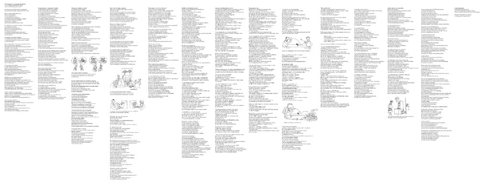

# sense-lining

A coding agent skill.

It lays out prose as Bradbury Thompson sense-lines 

on a Hugh Dubberly-style wide column sheet.

Returns an **SVG** and a matching **PDF**.

The process is [SKILL.md](SKILL.md). 

Typographic rules are [layout.md](layout.md). 

Page, type, and SVG rules are [format.md](format.md). 

The packer is [build_sheet.py](build_sheet.py).

## Use with a coding agent

1. Give the agent this directory (the repo URL, or download it).
2. Give it a source text. A PDF is fine.
3. Ask it to use this skill to lay out the text.

## Input

Any source the agent can read: PDF, web page, or already-clean text.

The agent produces two intermediates:

(It skips name_clean.txt if the source is already clean)

| File | What it is |
| --- | --- |
| `name_clean.txt` | Recoverable article: heads, body, figure callouts, lists, quotes. No OCR debris, page furniture, or bibliography. Inline `[n]` kept. Paragraphs intact, not yet lined. |
| `name_lines.txt` | One file line = one line of type. Markers: `=title`, `=authors`, `=journal`, `=column`, `=section`, `=subsection`, `=quote`, `=quoteattr`, `=list`, `=figure`, `*italic*`, `[n]`. |

## Output

| File | What it is |
| --- | --- |
| `name.svg` | One sheet: computed width × height in points |
| `name.pdf` | That drawing, one page, same point size |

Returned document = main text + figures in the flow. No bibliography.

Inline reference numbers stay as 7 pt superscripts. Type is 12 pt. No line longer than 324 pt.
